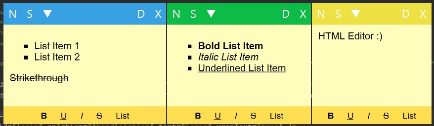
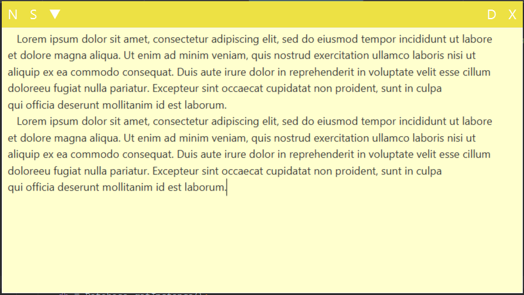

# Synchronous Sticky Notes
sync_notes is an application that allows you to synchronise sticky notes between android and desktop. This is the desktop application.
Inspired from Microsoft Sticky Notes.

# Screenshots

I used letters instead of icons.  

* N  -> New note 
* S  -> Synchronize (automatically backups old note) 
* ▼  -> Opens the menu (load backup, change theme) 
* D  -> Delete note 
* X  -> Close window 
